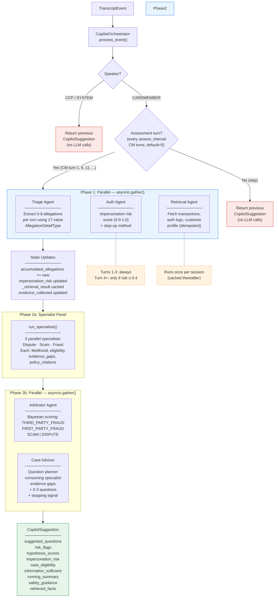

# Copilot Agent Workflow

The Realtime Copilot processes live transcript events during fraud servicing calls. It uses a hub-and-spoke architecture where the `CopilotOrchestrator` (a plain Python class, not an Agents SDK Agent) explicitly controls which specialist agents run and when.

---

## Overview



Only **CARDMEMBER** events trigger the agent pipeline, and only on **assessment turns** — every `assess_interval` CM turns (default 5). CM turns 1, 6, 11, 16, ... run the full pipeline; all other turns return the previous suggestion immediately. CCP and SYSTEM events never trigger the pipeline.

For assessment turns the pipeline is:

1. **Phase 1 (parallel)**: Triage + Auth (conditional) + Retrieval
2. **Phase 2a**: Specialist Panel (3 parallel specialists: Dispute, Scam, Fraud)
3. **Phase 2b (parallel)**: Arbitrator + Case Advisor — or Arbitrator only on turns 1-3

---

## Phase 1 — Parallel (`asyncio.gather`)

### 1. Triage Agent

**Role**: Extract structured allegations from cardmember statements.

| Direction | Field | Type | Description |
|-----------|-------|------|-------------|
| **INPUT** | `conversation_history` | `list[(speaker, text)]` | Context + new turns since last assessment (marked [CONTEXT]/[NEW]/[LATEST TURN]) |
| **INPUT** | `new_turn_offset` | `int` | Index where [NEW] turns begin (entries before are [CONTEXT]) |
| **INPUT** | `allegation_summary` | `str \| None` | Previously extracted allegations for dedup (when allegations exist) |
| **INPUT** | `model_provider` | `ModelProvider` | LLM provider for inference |

| Direction | Field | Type | Description |
|-----------|-------|------|-------------|
| **OUTPUT** | `allegations` | `list[AllegationExtraction]` | 0-8 per turn (typically 0-2) |
| | `.detail_type` | `AllegationDetailType` | One of 17 values (e.g. `UNRECOGNIZED_TRANSACTION`, `LOST_STOLEN_CARD`, `GOODS_NOT_RECEIVED`, `DUPLICATE_CHARGE`) |
| | `.description` | `str` | Paraphrase of what the CM alleged |
| | `.entities` | `dict[str, str]` | Structured key-value pairs (e.g. `merchant_name`, `amount`, `transaction_date`) |
| | `.confidence` | `float` | 0.0-1.0 extraction confidence |
| | `.context` | `str` | Relevant quote from the current turn |

**Side effects**:
- Accumulated into `orchestrator.accumulated_allegations`
- Persisted as `AllegationStatement` evidence nodes via the Tool Gateway

---

### 2. Auth Agent (conditional)

**Role**: Assess impersonation risk of the caller.

**Condition**: Runs if `cm_turn <= 3` OR `impersonation_risk >= 0.4`.

| Direction | Field | Type | Description |
|-----------|-------|------|-------------|
| **INPUT** | `transcript_text` | `str` | Current turn's raw text (behavioral cues) |
| **INPUT** | `auth_events` | `list[dict]` | Auth event records from retrieval (failed attempts, device fingerprints, login history) |
| **INPUT** | `customer_profile` | `dict \| None` | Customer profile from retrieval (call patterns, geo, recent account changes) |
| **INPUT** | `conversation_history` | `list[(speaker, text)] \| None` | Recent conversation turns for multi-turn behavioral pattern detection |
| **INPUT** | `model_provider` | `ModelProvider` | LLM provider for inference |

| Direction | Field | Type | Description |
|-----------|-------|------|-------------|
| **OUTPUT** | `impersonation_risk` | `float` | 0.0-1.0 — LOW (0.0-0.3), MED (0.3-0.6), HIGH (0.6-0.8), CRITICAL (0.8+) |
| **OUTPUT** | `risk_factors` | `list[str]` | e.g. "Hesitation on account details", "Device fingerprint mismatch" |
| **OUTPUT** | `step_up_recommended` | `bool` | Whether step-up authentication is recommended |
| **OUTPUT** | `step_up_method` | `str` | `NONE` \| `SMS_OTP` \| `CALLBACK` \| `SECURITY_QUESTIONS` |
| **OUTPUT** | `assessment_summary` | `str` | Brief explanation of the overall assessment |

**Side effects**:
- Updates `orchestrator.impersonation_risk`
- Appends `risk_factors` and step-up flag to `risk_flags`

---

### 3. Retrieval Agent (idempotent)

**Role**: Fetch all case data via Tool Gateway. Runs once per session, returns cached result after.

| Direction | Field | Type | Description |
|-----------|-------|------|-------------|
| **INPUT** | `case_id` | `str` | Case identifier |
| **INPUT** | `call_id` | `str` | Current call identifier |
| **INPUT** | `gateway` | `ToolGateway` | Mediated data access |
| **INPUT** | `model_provider` | `ModelProvider` | LLM provider for inference |

**Tools used** (via `CopilotContext`):
- `tool_lookup_transactions` — TRANSACTION-type evidence nodes (PAN-masked)
- `tool_query_auth_logs` — AUTH_EVENT-type evidence nodes
- `tool_fetch_customer_profile` — CUSTOMER-type evidence node

| Direction | Field | Type | Description |
|-----------|-------|------|-------------|
| **OUTPUT** | `transactions` | `list[dict]` | Transaction records (PAN-masked) |
| **OUTPUT** | `auth_events` | `list[dict]` | Authentication event records |
| **OUTPUT** | `customer_profile` | `dict \| None` | Customer profile (if found) |
| **OUTPUT** | `retrieval_summary` | `str` | Plain-language summary of what was found |
| **OUTPUT** | `data_gaps` | `list[str]` | e.g. "No auth events for disputed txn period" |

**Side effects**:
- Cached in `orchestrator._retrieval_result`
- Fed into Auth Agent (`auth_events`, `customer_profile`) and Specialist Panel (`evidence_summary`)

---

## Phase 2a — Specialist Panel

### 4. Specialist Panel (`run_specialists`)

**Role**: Three parallel category specialists evaluate allegations and evidence against policy checklists.

Each specialist focuses on one category: **Dispute**, **Scam**, or **Third-Party Fraud**. They run in parallel via `asyncio.gather` and produce independent assessments including likelihood, eligibility, evidence gaps, and policy citations. Their outputs are consumed by both the Arbitrator (for scoring) and the Case Advisor (for question generation).

| Direction | Field | Type | Description |
|-----------|-------|------|-------------|
| **INPUT** | `allegations_summary` | `str` | All accumulated allegations formatted with types, descriptions, confidence, and entities |
| **INPUT** | `evidence_summary` | `str` | Structured JSON of transactions, auth events, customer profile from retrieval |
| **INPUT** | `conversation_summary` | `str` | Last 5 turns + total turn count |
| **INPUT** | `model_provider` | `ModelProvider` | LLM provider for inference |
| **INPUT** | `previous_assessments` | `dict[str, SpecialistAssessment] \| None` | Previous turn's specialist outputs for continuity |

| Direction | Field | Type | Description |
|-----------|-------|------|-------------|
| **OUTPUT** | `assessments` | `dict[str, SpecialistAssessment]` | Keyed by category: `DISPUTE`, `SCAM`, `THIRD_PARTY_FRAUD` |
| | `.category` | `str` | The investigation category |
| | `.likelihood` | `float` | 0.0-1.0 likelihood this category explains the case |
| | `.reasoning` | `str` | Explanation of the assessment |
| | `.supporting_evidence` | `list[str]` | Evidence supporting this category |
| | `.contradicting_evidence` | `list[str]` | Evidence contradicting this category |
| | `.policy_citations` | `list[str]` | Specific policy text cited |
| | `.evidence_gaps` | `list[str]` | Information still needed for this category |
| | `.eligibility` | `str` | `"eligible"` \| `"blocked"` — whether the case can proceed under this category |

**Side effects**:
- Cached in `orchestrator._last_specialist_assessments` for next-turn continuity

---

## Phase 2b — Arbitrator + Case Advisor (parallel on turn 4+)

### 5. Arbitrator Agent

**Role**: Score 4 investigation categories as a probability distribution, synthesizing specialist assessments.

| Direction | Field | Type | Description |
|-----------|-------|------|-------------|
| **INPUT** | `specialist_assessments` | `dict[str, SpecialistAssessment]` | Outputs from the specialist panel |
| **INPUT** | `allegations_summary` | `str` | All accumulated allegations formatted with types, descriptions, confidence, and entities |
| **INPUT** | `auth_summary` | `str` | Formatted auth assessment (impersonation risk, risk factors, step-up method, summary) |
| **INPUT** | `current_scores` | `dict[str, float]` | Previous turn's hypothesis scores (Bayesian prior): `{THIRD_PARTY_FRAUD, FIRST_PARTY_FRAUD, SCAM, DISPUTE}` |
| **INPUT** | `model_provider` | `ModelProvider` | LLM provider for inference |
| **INPUT** | `previous_reasoning` | `HypothesisAssessment \| None` | Previous turn's full assessment for reasoning continuity |

| Direction | Field | Type | Description |
|-----------|-------|------|-------------|
| **OUTPUT** | `scores` | `dict[str, float]` | `{THIRD_PARTY_FRAUD: 0.XX, FIRST_PARTY_FRAUD: 0.XX, SCAM: 0.XX, DISPUTE: 0.XX}` (sums to ~1.0) |
| **OUTPUT** | `reasoning` | `dict[str, str]` | Per-category explanation (1-3 sentences each) |
| **OUTPUT** | `contradictions` | `list[str]` | Detected contradictions between allegations and evidence |
| **OUTPUT** | `assessment_summary` | `str` | 2-4 sentence overall assessment |

**Side effects**:
- Updates `orchestrator.hypothesis_scores`
- `specialist_assessments` attached to result for downstream access

---

### 6. Case Advisor (parallel with Arbitrator on turn 4+)

**Role**: Question planner consuming specialist outputs — generates next-best questions targeting evidence gaps identified by specialists.

**Condition**: Skipped on turns 1-3 (not enough info yet). On turn 4+, runs in parallel with the Arbitrator using the **previous turn's** hypothesis scores (acceptable since scores shift incrementally via the Bayesian prior design).

| Direction | Field | Type | Description |
|-----------|-------|------|-------------|
| **INPUT** | `specialist_assessments` | `dict[str, SpecialistAssessment]` | Outputs from the specialist panel (eligibility, evidence gaps, policy citations) |
| **INPUT** | `hypothesis_scores` | `dict[str, float]` | Previous turn's scores (Bayesian prior) |
| **INPUT** | `conversation_window` | `list[(speaker, text)]` | Assessment-based conversation window (context + new turns) |
| **INPUT** | `recent_questions` | `list[str] \| None` | Previously suggested questions (last 3 turns, flattened) for dedup |
| **INPUT** | `model_provider` | `ModelProvider` | LLM provider for inference |

| Direction | Field | Type | Description |
|-----------|-------|------|-------------|
| **OUTPUT** | `assessments` | `list[CaseTypeAssessment]` | Mapped from specialist eligibility: one per case type (fraud, dispute) |
| | `.case_type` | `str` | `"fraud"` or `"dispute"` |
| | `.eligibility` | `str` | `"eligible"` \| `"blocked"` — mapped from specialist output |
| | `.unmet_criteria` | `list[str]` | Specialist-identified evidence gaps |
| | `.blockers` | `list[str]` | Blocking reasons from specialist reasoning (when blocked) |
| | `.policy_citations` | `list[str]` | Specific policy text cited by specialists |
| **OUTPUT** | `general_warnings` | `list[str]` | Cross-cutting warnings (escalation triggers, etc.) |
| **OUTPUT** | `questions` | `list[str]` | 0-3 suggested next-best questions (empty when sufficient) |
| **OUTPUT** | `rationale` | `list[str]` | Parallel list — why each question matters |
| **OUTPUT** | `priority_field` | `str` | Most important evidence gap targeted, or "" when sufficient |
| **OUTPUT** | `information_sufficient` | `bool` | `True` when leading hypothesis case type is eligible or all blocked |
| **OUTPUT** | `summary` | `str` | 2-4 sentence eligibility landscape + next steps |

**Stopping condition**: When the leading hypothesis case type is `eligible` or all types are `blocked` for non-resolvable reasons, `information_sufficient` is set to `True` and `questions` is empty. This signals to the CCP that enough information has been gathered to proceed.

**Side effects**:
- Questions tracked in `orchestrator._recent_suggestions` (rolling window of last 3 turns for dedup)

---

## Final Output

All agent results are assembled into a single `CopilotSuggestion`:

| Field | Type | Source |
|-------|------|--------|
| `call_id` | `str` | TranscriptEvent |
| `timestamp_ms` | `int` | TranscriptEvent |
| `suggested_questions` | `list[str]` | Case Advisor |
| `risk_flags` | `list[str]` | Auth Agent + all agent error flags |
| `retrieved_facts` | `list[str]` | Retrieval Agent summary |
| `running_summary` | `str` | Accumulated allegations summary |
| `safety_guidance` | `str` | Orchestrator logic (impersonation risk) |
| `hypothesis_scores` | `dict[str, float]` | Arbitrator Agent |
| `impersonation_risk` | `float` | Auth Agent |
| `case_eligibility` | `list[dict]` | Case Advisor assessments |
| `case_advisory_summary` | `str` | Case Advisor summary |
| `information_sufficient` | `bool` | Case Advisor stopping signal |

---

## Data Flow Summary

```
Triage --> accumulated_allegations --+
                                     |
Retrieval --> transactions ----------+-> Specialists --+--> Arbitrator --> hypothesis_scores
           |  auth_events -----------+   (Dispute,     |
           +- customer_profile ------+    Scam,        +--> Case Advisor
                  |                       Fraud)            (questions + stopping signal)
                  |                          |
                  +-> Auth Agent             +-- eligibility, evidence_gaps,
                       |                        policy_citations per category
                       +--> impersonation_risk
                       +--> risk_flags
                       +--> Arbitrator (auth_summary)
```

---

## Key Design Points

- **Hub-and-spoke**: The orchestrator explicitly controls which agents run and when. No free handoffs.
- **6 agents in 3 phases**: Triage, Auth, Retrieval (Phase 1) → 3 category Specialists (Phase 2a) → Arbitrator + Case Advisor (Phase 2b).
- **Specialist panel as shared resource**: Three category specialists (Dispute, Scam, Third-Party Fraud) run once in Phase 2a. Their outputs feed both the Arbitrator (for Bayesian scoring) and the Case Advisor (for question generation), eliminating redundant policy evaluation.
- **Specialist eligibility**: Each specialist outputs `eligible` or `blocked` plus `evidence_gaps` and `policy_citations`. The Case Advisor maps these directly to `CaseTypeAssessment` objects — no separate eligibility evaluation needed.
- **Conditional auth**: Auth agent is skipped after turn 3 if impersonation risk drops below 0.4, saving an LLM call.
- **Retrieval with cache invalidation**: Retrieval caches its result but invalidates when triage persists new allegations (evidence store changed). Re-fetches in parallel on the next assessment turn.
- **Case advisor gating + parallelism**: Skipped on turns 1-3. On turn 4+, runs in parallel with the Arbitrator using the previous turn's scores.
- **Lightweight case advisor**: Case Advisor is a question planner only — it consumes specialist-provided eligibility and evidence gaps rather than evaluating policies itself.
- **Question dedup**: Case Advisor receives the last 3 turns of suggested questions to avoid repetition.
- **All agents traced**: Every invocation is logged to the trace store with agent name, duration, and status.
- **Error isolation**: Each agent is wrapped in a `_run_*_safe` method. Failures append to `risk_flags` but never crash the pipeline.

---

## Observability (LangFuse)

Optional LangFuse integration provides full LLM observability on top of the built-in SQLite trace store.

### Setup

Set three environment variables (in `.env` or shell):

```bash
# Option 1: LangFuse Cloud (for testing)
LANGFUSE_BASE_URL=https://us.cloud.langfuse.com
LANGFUSE_PUBLIC_KEY=pk-lf-...
LANGFUSE_SECRET_KEY=sk-lf-...

# Option 2: Self-hosted (for enterprise)
LANGFUSE_BASE_URL=http://localhost:3000
LANGFUSE_PUBLIC_KEY=pk-lf-...
LANGFUSE_SECRET_KEY=sk-lf-...
```

When `LANGFUSE_PUBLIC_KEY` and `LANGFUSE_SECRET_KEY` are set, LangFuse is enabled automatically at app startup. When unset, the system operates normally without LangFuse.

### What's Captured

**Auto-instrumented** (via `openinference-instrumentation-openai-agents`):
- Every `Runner.run()` LLM call across all 6 agents (including 3 specialists): prompts, completions, tokens, model, latency
- Tool invocations with arguments and return values
- Agent handoffs

**Orchestrator-added context** (via `propagate_attributes` + `start_as_current_observation`):
- `session_id` — groups all turns for one case
- Phase spans: `phase1_parallel`, `phase2a_specialists`, `phase2b_arbitrator_advisor`
- Turn metadata: `cm_turn`, `assess_interval`

### Trace Hierarchy

```
Trace: "copilot_turn" (session_id=case_id)
├─ Span: "phase1_parallel"
│  ├─ auto: triage → LLM generation + tool calls
│  ├─ auto: auth → LLM generation
│  └─ auto: retrieval → LLM generation + tool calls
├─ Span: "phase2a_specialists"
│  ├─ auto: dispute_specialist → LLM generation
│  ├─ auto: scam_specialist → LLM generation
│  └─ auto: fraud_specialist → LLM generation
└─ Span: "phase2b_arbitrator_advisor"
   ├─ auto: arbitrator → LLM generation
   └─ auto: case_advisor → LLM generation
```

### Self-hosted Deployment

```bash
git clone https://github.com/langfuse/langfuse.git
cd langfuse
docker compose up -d
```

Then set `LANGFUSE_BASE_URL=http://localhost:3000` and create API keys in the LangFuse UI under Settings → API Keys.
