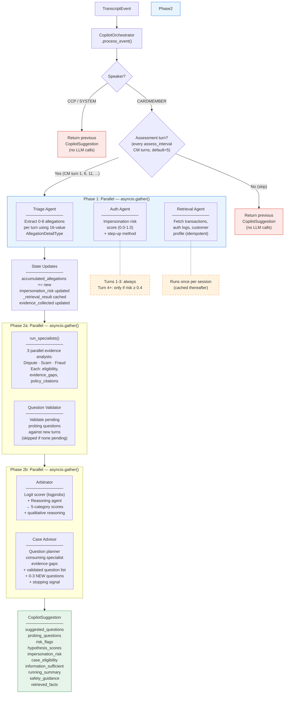

# Copilot Agent Workflow

The Realtime Copilot processes live transcript events during fraud servicing calls. It uses a hub-and-spoke architecture where the `CopilotOrchestrator` (a plain Python class, not an Agents SDK Agent) explicitly controls which specialist agents run and when.

---

## Overview



Only **CARDMEMBER** events trigger the agent pipeline, and only on **assessment turns** — every `assess_interval` CM turns (default 5). CM turns 1, 6, 11, 16, ... run the full pipeline; all other turns return the previous suggestion immediately. CCP and SYSTEM events never trigger the pipeline.

For assessment turns the pipeline is:

1. **Phase 1 (parallel)**: Triage + Auth (conditional) + Retrieval
2. **Phase 2a (parallel)**: Specialist Panel (3 parallel specialists) + Question Validator (validates pending probing questions; skipped if none pending)
3. **Phase 2b (parallel)**: Arbitrator + Case Advisor — or Arbitrator only on turns 1-3

---

## Phase 1 — Parallel (`asyncio.gather`)

### 1. Triage Agent

**Role**: Extract structured allegations from cardmember statements.

| Direction | Field | Type | Description |
|-----------|-------|------|-------------|
| **INPUT** | `conversation_history` | `list[(speaker, text)]` | Context + new turns since last assessment (marked [CONTEXT]/[NEW]/[LATEST TURN]) |
| **INPUT** | `new_turn_offset` | `int` | Index where [NEW] turns begin (entries before are [CONTEXT]) |
| **INPUT** | `allegation_summary` | `str \| None` | Previously extracted allegations for dedup (when allegations exist) |
| **INPUT** | `model_provider` | `ModelProvider` | LLM provider for inference |

| Direction | Field | Type | Description |
|-----------|-------|------|-------------|
| **OUTPUT** | `allegations` | `list[AllegationExtraction]` | 0-8 per turn (typically 0-2) |
| | `.detail_type` | `AllegationDetailType` | One of 16 values extracted by triage (e.g. `LOST_STOLEN_CARD`, `GOODS_NOT_RECEIVED`, `DUPLICATE_CHARGE`). `UNRECOGNIZED_TRANSACTION` is handled by the retrieval agent. |
| | `.description` | `str` | Paraphrase of what the CM alleged |
| | `.entities` | `dict[str, str]` | Structured key-value pairs (e.g. `merchant_name`, `amount`, `transaction_date`) |
| | `.confidence` | `float` | 0.0-1.0 extraction confidence |
| | `.context` | `str` | Relevant quote from the current turn |

**Side effects**:
- Accumulated into `orchestrator.accumulated_allegations`
- Persisted as `AllegationStatement` evidence nodes via the Tool Gateway

---

### 2. Auth Agent (conditional)

**Role**: Assess impersonation risk of the caller.

**Condition**: Runs if `cm_turn <= 3` OR `impersonation_risk >= 0.4`.

| Direction | Field | Type | Description |
|-----------|-------|------|-------------|
| **INPUT** | `transcript_text` | `str` | Current turn's raw text (behavioral cues) |
| **INPUT** | `auth_events` | `list[dict]` | Auth event records from retrieval (failed attempts, device fingerprints, login history) |
| **INPUT** | `customer_profile` | `dict \| None` | Customer profile from retrieval (call patterns, geo, recent account changes) |
| **INPUT** | `conversation_history` | `list[(speaker, text)] \| None` | Recent conversation turns for multi-turn behavioral pattern detection |
| **INPUT** | `model_provider` | `ModelProvider` | LLM provider for inference |

| Direction | Field | Type | Description |
|-----------|-------|------|-------------|
| **OUTPUT** | `impersonation_risk` | `float` | 0.0-1.0 — LOW (0.0-0.3), MED (0.3-0.6), HIGH (0.6-0.8), CRITICAL (0.8+) |
| **OUTPUT** | `risk_factors` | `list[str]` | e.g. "Hesitation on account details", "Device fingerprint mismatch" |
| **OUTPUT** | `step_up_recommended` | `bool` | Whether step-up authentication is recommended |
| **OUTPUT** | `step_up_method` | `str` | `NONE` \| `SMS_OTP` \| `CALLBACK` \| `SECURITY_QUESTIONS` |
| **OUTPUT** | `assessment_summary` | `str` | Brief explanation of the overall assessment |

**Side effects**:
- Updates `orchestrator.impersonation_risk`
- Appends `risk_factors` and step-up flag to `risk_flags`

---

### 3. Retrieval Agent (idempotent)

**Role**: Fetch all case data via Tool Gateway. Runs once per session, returns cached result after.

| Direction | Field | Type | Description |
|-----------|-------|------|-------------|
| **INPUT** | `case_id` | `str` | Case identifier |
| **INPUT** | `call_id` | `str` | Current call identifier |
| **INPUT** | `gateway` | `ToolGateway` | Mediated data access |
| **INPUT** | `model_provider` | `ModelProvider` | LLM provider for inference |

**Tools used** (via `CopilotContext`):
- `tool_lookup_transactions` — TRANSACTION-type evidence nodes (PAN-masked)
- `tool_query_auth_logs` — AUTH_EVENT-type evidence nodes
- `tool_fetch_customer_profile` — CUSTOMER-type evidence node

| Direction | Field | Type | Description |
|-----------|-------|------|-------------|
| **OUTPUT** | `transactions` | `list[dict]` | Transaction records (PAN-masked) |
| **OUTPUT** | `auth_events` | `list[dict]` | Authentication event records |
| **OUTPUT** | `customer_profile` | `dict \| None` | Customer profile (if found) |
| **OUTPUT** | `retrieval_summary` | `str` | Plain-language summary of what was found |
| **OUTPUT** | `data_gaps` | `list[str]` | e.g. "No auth events for disputed txn period" |

**Side effects**:
- Cached in `orchestrator._retrieval_result`
- Fed into Auth Agent (`auth_events`, `customer_profile`) and Specialist Panel (`evidence_summary`)

---

## Phase 2a — Specialist Panel

### 4. Specialist Panel (`run_specialists`)

**Role**: Three parallel evidence analysts evaluate allegations and evidence against policy checklists.

Each specialist focuses on one category: **Dispute**, **Scam**, or **Third-Party Fraud**. They run in parallel via `asyncio.gather` and produce independent evidence analyses including eligibility, supporting/contradicting evidence, evidence gaps, and policy citations. They do NOT produce likelihood scores — scoring is handled by the Arbitrator's logprob-based scorer. Their outputs are consumed by both the Arbitrator (for scoring and reasoning) and the Case Advisor (for question generation).

**Incremental note updates**: On the first assessment turn, each specialist outputs a full `SpecialistAssessment`. On subsequent turns, it outputs a `SpecialistNoteUpdate` containing only what changed — narrative fields (reasoning, policy_citations, eligibility) are regenerated in full, while evidence lists (supporting_evidence, contradicting_evidence, evidence_gaps) are updated via explicit add/remove operations. The host merges deltas deterministically via `merge_specialist_notes()`. This prevents evidence flickering — items from previous turns persist unless explicitly removed, rather than being regenerated from scratch each turn.

| Direction | Field | Type | Description |
|-----------|-------|------|-------------|
| **INPUT** | `allegations_summary` | `str` | All accumulated allegations formatted with types, descriptions, confidence, and entities |
| **INPUT** | `evidence_summary` | `str` | Structured JSON of transactions, auth events, customer profile from retrieval |
| **INPUT** | `conversation_summary` | `str` | Last 5 turns + total turn count |
| **INPUT** | `model_provider` | `ModelProvider` | LLM provider for inference |
| **INPUT** | `previous_assessments` | `dict[str, SpecialistAssessment] \| None` | Previous turn's specialist outputs (shown as "Working Notes" to the LLM) |

| Direction | Field | Type | Description |
|-----------|-------|------|-------------|
| **OUTPUT** | `assessments` | `dict[str, SpecialistAssessment]` | Keyed by category: `DISPUTE`, `SCAM`, `THIRD_PARTY_FRAUD` (merged state) |
| **OUTPUT** | `deltas` | `dict[str, SpecialistNoteUpdate]` | Raw deltas from this turn (empty on first turn or failure) |
| | `.category` | `str` | The investigation category |
| | `.reasoning` | `str` | Explanation of the assessment (regenerated) |
| | `.supporting_evidence` | `list[str]` | Evidence supporting this category (merged) |
| | `.contradicting_evidence` | `list[str]` | Evidence contradicting this category (merged) |
| | `.policy_citations` | `list[str]` | Specific policy text cited (regenerated) |
| | `.evidence_gaps` | `list[str]` | Information still needed for this category (merged) |
| | `.eligibility` | `str` | `"eligible"` \| `"blocked"` — whether the case can proceed under this category (regenerated) |

**Side effects**:
- Merged assessments cached in `orchestrator._last_specialist_assessments` for next-turn continuity
- Raw deltas cached in `orchestrator._last_specialist_deltas` for the Arbitrator

---

### 4b. Question Validator (parallel with Specialist Panel)

**Role**: Validate pending probing questions against new conversation turns. Determines whether each pending question has been answered, invalidated, or remains pending.

**Condition**: Skipped entirely when there are no pending probing questions (no LLM call).

| Direction | Field | Type | Description |
|-----------|-------|------|-------------|
| **INPUT** | `pending_questions` | `list[ProbingQuestion]` | Questions with status="pending" from the probing list |
| **INPUT** | `new_turns` | `list[(speaker, text)]` | Transcript turns since questions were last evaluated |
| **INPUT** | `hypothesis_scores` | `dict[str, float]` | Current 5-category scores (for invalidation checks) |
| **INPUT** | `model_provider` | `ModelProvider` | LLM provider for inference |

| Direction | Field | Type | Description |
|-----------|-------|------|-------------|
| **OUTPUT** | `updates` | `list[QuestionUpdate]` | One per pending question: new_status + reason |
| | `.question_text` | `str` | Original question text (for matching) |
| | `.new_status` | `str` | `"pending"` \| `"answered"` \| `"invalidated"` |
| | `.reason` | `str` | Why status changed (empty when still pending) |

**Side effects**:
- Updates `orchestrator._probing_questions` statuses in place (sets `turn_resolved` to current turn)

---

## Phase 2b — Arbitrator + Case Advisor (parallel on turn 4+)

### 5. Arbitrator (Logit Scorer + Reasoning Agent)

**Role**: Produce a 5-category probability distribution and qualitative reasoning by combining two parallel calls.

The arbitrator makes two parallel calls via `asyncio.gather`:

1. **Logit scorer** (raw OpenAI API) — forced-choice A/B/C/D classification with `max_tokens=1, logprobs=True, top_logprobs=10`. The logprob distribution over answer tokens becomes the 4-category score. `UNABLE_TO_DETERMINE` is derived from the Shannon entropy of the 4-category distribution (higher entropy → higher UTD). This produces more consistent and grounded scores than asking the LLM to generate float values.

2. **Reasoning agent** (Agents SDK) — qualitative analysis producing per-category reasoning (4 keys — no UTD, which is entropy-derived), contradiction detection, and first-party fraud identification. Does NOT produce scores.

Both calls receive merged specialist state AND specialist deltas ("Changes this turn" sections) so they can see what shifted since the last assessment.

**Incremental reasoning**: On the first turn, the reasoning agent outputs a full `HypothesisReasoning`. On subsequent turns, it outputs a `ReasoningNoteUpdate` — reasoning and assessment_summary are regenerated, but contradictions are incrementally updated via add/remove. The host merges via `merge_reasoning_notes()`.

| Direction | Field | Type | Description |
|-----------|-------|------|-------------|
| **INPUT** | `specialist_assessments` | `dict[str, SpecialistAssessment]` | Merged evidence analyses from the specialist panel |
| **INPUT** | `allegations_summary` | `str` | All accumulated allegations formatted with types, descriptions, confidence, and entities |
| **INPUT** | `auth_summary` | `str` | Formatted auth assessment (impersonation risk, risk factors, step-up method, summary) |
| **INPUT** | `current_scores` | `dict[str, float]` | Previous turn's hypothesis scores: `{THIRD_PARTY_FRAUD, FIRST_PARTY_FRAUD, SCAM, DISPUTE, UNABLE_TO_DETERMINE}` |
| **INPUT** | `model_provider` | `ModelProvider` | LLM provider for the reasoning agent |
| **INPUT** | `openai_client` | `AsyncOpenAI` | Raw OpenAI client for the logprob scorer |
| **INPUT** | `previous_reasoning` | `HypothesisAssessment \| None` | Previous turn's full assessment for reasoning continuity |
| **INPUT** | `specialist_deltas` | `dict[str, SpecialistNoteUpdate] \| None` | Raw specialist deltas from this turn (empty on first turn) |

| Direction | Field | Type | Description |
|-----------|-------|------|-------------|
| **OUTPUT** | `scores` | `dict[str, float]` | `{THIRD_PARTY_FRAUD: 0.XX, FIRST_PARTY_FRAUD: 0.XX, SCAM: 0.XX, DISPUTE: 0.XX, UNABLE_TO_DETERMINE: 0.XX}` (sums to 1.0). From logprob scorer. |
| **OUTPUT** | `reasoning` | `dict[str, str]` | Per-category explanation for 4 real categories (1-3 sentences each). UTD has no reasoning — its score is entropy-derived. From reasoning agent (merged). |
| **OUTPUT** | `contradictions` | `list[str]` | Detected contradictions between allegations and evidence. From reasoning agent (incrementally updated). |
| **OUTPUT** | `assessment_summary` | `str` | 2-4 sentence overall assessment. From reasoning agent. |

**Side effects**:
- Updates `orchestrator.hypothesis_scores`
- `specialist_assessments` attached to result for downstream access

---

### 6. Case Advisor (parallel with Arbitrator on turn 4+)

**Role**: Question planner consuming specialist outputs — generates next-best questions targeting evidence gaps identified by specialists.

**Condition**: Skipped on turns 1-3 (not enough info yet). On turn 4+, runs in parallel with the Arbitrator using the **previous turn's** hypothesis scores (acceptable since scores shift incrementally via the Bayesian prior design).

| Direction | Field | Type | Description |
|-----------|-------|------|-------------|
| **INPUT** | `specialist_assessments` | `dict[str, SpecialistAssessment]` | Outputs from the specialist panel (eligibility, evidence gaps, policy citations) |
| **INPUT** | `hypothesis_scores` | `dict[str, float]` | Previous turn's scores (Bayesian prior) |
| **INPUT** | `conversation_window` | `list[(speaker, text)]` | Assessment-based conversation window (context + new turns) |
| **INPUT** | `probing_questions` | `list[ProbingQuestion] \| None` | Full probing question list with lifecycle statuses (pending/answered/invalidated) |
| **INPUT** | `model_provider` | `ModelProvider` | LLM provider for inference |

| Direction | Field | Type | Description |
|-----------|-------|------|-------------|
| **OUTPUT** | `assessments` | `list[CaseTypeAssessment]` | Mapped from specialist eligibility: one per case type (fraud, dispute) |
| | `.case_type` | `str` | `"fraud"` or `"dispute"` |
| | `.eligibility` | `str` | `"eligible"` \| `"blocked"` — mapped from specialist output |
| | `.unmet_criteria` | `list[str]` | Specialist-identified evidence gaps |
| | `.blockers` | `list[str]` | Blocking reasons from specialist reasoning (when blocked) |
| | `.policy_citations` | `list[str]` | Specific policy text cited by specialists |
| **OUTPUT** | `general_warnings` | `list[str]` | Cross-cutting warnings (escalation triggers, etc.) |
| **OUTPUT** | `questions` | `list[str]` | 0-3 NEW suggested questions (empty when sufficient) |
| **OUTPUT** | `question_targets` | `list[str]` | Parallel list — target investigation category per question |
| **OUTPUT** | `rationale` | `list[str]` | Parallel list — why each question matters |
| **OUTPUT** | `priority_field` | `str` | Most important evidence gap targeted, or "" when sufficient |
| **OUTPUT** | `information_sufficient` | `bool` | `True` when leading hypothesis case type is eligible or all blocked |
| **OUTPUT** | `summary` | `str` | 2-4 sentence eligibility landscape + next steps |

**Stopping condition**: When all probing questions are answered or invalidated AND no new questions are needed, OR the leading hypothesis case type is `eligible` or all types are `blocked` for non-resolvable reasons, `information_sufficient` is set to `True` and `questions` is empty. This signals to the CCP that enough information has been gathered to proceed.

**Side effects**:
- New questions appended to `orchestrator._probing_questions` as `ProbingQuestion` entries with status="pending", turn_suggested, and target_category

---

## Final Output

All agent results are assembled into a single `CopilotSuggestion`:

| Field | Type | Source |
|-------|------|--------|
| `call_id` | `str` | TranscriptEvent |
| `timestamp_ms` | `int` | TranscriptEvent |
| `suggested_questions` | `list[str]` | All currently pending probing questions |
| `probing_questions` | `list[dict]` | Full question list snapshot with lifecycle statuses |
| `risk_flags` | `list[str]` | Auth Agent + all agent error flags |
| `retrieved_facts` | `list[str]` | Retrieval Agent summary |
| `running_summary` | `str` | Accumulated allegations summary |
| `safety_guidance` | `str` | Orchestrator logic (impersonation risk) |
| `hypothesis_scores` | `dict[str, float]` | Arbitrator Agent |
| `impersonation_risk` | `float` | Auth Agent |
| `case_eligibility` | `list[dict]` | Case Advisor assessments |
| `case_advisory_summary` | `str` | Case Advisor summary |
| `information_sufficient` | `bool` | Case Advisor stopping signal |

---

## Data Flow Summary

```
Triage --> accumulated_allegations --+
                                     |
Retrieval --> transactions ----------+-> Specialists ──────────────────────┐
           |  auth_events -----------+   (Dispute,                         |
           +- customer_profile ------+    Scam,    returns:                |
                  |                       Fraud)   (assessments, deltas)   |
                  |                          |          │                  |
                  +-> Auth Agent             |     ┌────┘                  |
                       |                     |     │                      |
                       +--> impersonation_risk     +--> Arbitrator ──┐    |
                       +--> risk_flags             |    (merged state |    |
                       +--> Arbitrator             |     + deltas)    |    |
                            (auth_summary)         |    ├─ Logit scorer (logprobs) → scores
                                              +----+    └─ Reasoning agent → reasoning
                                              |              (incremental contradictions)
                                              |               │
                                              |               +--> hypothesis_scores
                                              |
                                              +--> Case Advisor
                                              |    (validated question list
                                              |     + NEW questions + stopping)
                                              |
                                              +-- Question Validator
                                                  (pending questions + new turns
                                                   --> answered/invalidated/pending)
```

---

## Key Design Points

- **Hub-and-spoke**: The orchestrator explicitly controls which agents run and when. No free handoffs.
- **7 agents in 3 phases**: Triage, Auth, Retrieval (Phase 1) → 3 category Specialists + Question Validator (Phase 2a) → Arbitrator + Case Advisor (Phase 2b).
- **Specialist panel as shared resource**: Three category specialists (Dispute, Scam, Third-Party Fraud) run once in Phase 2a as evidence analysts — they classify evidence as supporting/contradicting/gap but do not produce scores. Their outputs feed both the Arbitrator (for logprob scoring and reasoning) and the Case Advisor (for question generation), eliminating redundant policy evaluation.
- **Structured diff/patch memory**: Specialists and the reasoning agent use incremental note updates to prevent evidence flickering across turns. On the first turn, agents output full assessments. On subsequent turns, they output deltas — narrative fields are regenerated, evidence lists are updated via explicit add/remove operations. The host merges deltas deterministically. Evidence items persist unless explicitly removed, ensuring stable evidence accumulation across the investigation.
- **Logprob-based scoring**: Hypothesis scores come from logprob distributions over forced-choice classification tokens (A/B/C/D), reflecting the model's actual internal confidence rather than fabricated float values. This produces more consistent scores across runs. `UNABLE_TO_DETERMINE` is derived from Shannon entropy — not a class the model picks.
- **Specialist eligibility**: Each specialist outputs `eligible` or `blocked` plus `evidence_gaps` and `policy_citations`. The Case Advisor maps these directly to `CaseTypeAssessment` objects — no separate eligibility evaluation needed.
- **Conditional auth**: Auth agent is skipped after turn 3 if impersonation risk drops below 0.4, saving an LLM call.
- **Retrieval with cache invalidation**: Retrieval caches its result but invalidates when triage persists new allegations (evidence store changed). Re-fetches in parallel on the next assessment turn.
- **Case advisor gating + parallelism**: Skipped on turns 1-3. On turn 4+, runs in parallel with the Arbitrator using the previous turn's scores.
- **Lightweight case advisor**: Case Advisor is a question planner only — it consumes specialist-provided eligibility and evidence gaps rather than evaluating policies itself.
- **Question lifecycle**: A persistent `ProbingQuestion` list tracks each suggested question from creation to resolution (pending → answered / invalidated). The Question Validator runs in parallel with specialists (zero added latency) to check pending questions against new turns. The Case Advisor receives the full validated list and generates only new, unique questions. When all questions are resolved and no new ones are needed, probing is complete (`information_sufficient = True`).
- **All agents traced**: Every invocation is logged to the trace store with agent name, duration, and status.
- **Error isolation**: Each agent is wrapped in a `_run_*_safe` method. Failures append to `risk_flags` but never crash the pipeline.

---

## Observability (LangFuse)

Optional LangFuse integration provides full LLM observability on top of the built-in SQLite trace store.

### Setup

Set three environment variables (in `.env` or shell):

```bash
# Option 1: LangFuse Cloud (for testing)
LANGFUSE_BASE_URL=https://us.cloud.langfuse.com
LANGFUSE_PUBLIC_KEY=pk-lf-...
LANGFUSE_SECRET_KEY=sk-lf-...

# Option 2: Self-hosted (for enterprise)
LANGFUSE_BASE_URL=http://localhost:3000
LANGFUSE_PUBLIC_KEY=pk-lf-...
LANGFUSE_SECRET_KEY=sk-lf-...
```

When `LANGFUSE_PUBLIC_KEY` and `LANGFUSE_SECRET_KEY` are set, LangFuse is enabled automatically at app startup. When unset, the system operates normally without LangFuse.

### What's Captured

**Auto-instrumented** (via `openinference-instrumentation-openai-agents`):
- Every `Runner.run()` LLM call across all agents (including 3 specialists + hypothesis reasoning): prompts, completions, tokens, model, latency
- Tool invocations with arguments and return values
- Agent handoffs

**Manually instrumented** (via `langfuse.generation()`):
- `logit_scorer` — the raw `AsyncOpenAI` call for logprob-based scoring bypasses the Agents SDK's `Runner.run()`, so it has a manual LangFuse generation span recording: model, prompt, completion token, logprobs, category probabilities, entropy, final scores, and latency

**Orchestrator-added context** (via `propagate_attributes` + `start_as_current_observation`):
- `session_id` — groups all turns for one case
- Phase spans: `phase1_parallel`, `phase2a_specialists`, `phase2b_arbitrator_advisor`
- Turn metadata: `cm_turn`, `assess_interval`

### Trace Hierarchy

```
Trace: "copilot_turn" (session_id=case_id)
├─ Span: "phase1_parallel"
│  ├─ auto: triage → LLM generation + tool calls
│  ├─ auto: auth → LLM generation
│  └─ auto: retrieval → LLM generation + tool calls
├─ Span: "phase2a_specialists"
│  ├─ auto: dispute_specialist → LLM generation
│  ├─ auto: scam_specialist → LLM generation
│  ├─ auto: fraud_specialist → LLM generation
│  └─ auto: question_validator → LLM generation (skipped if no pending questions)
├─ Span: "phase2b_arbitrator_advisor"
│  ├─ manual: logit_scorer → OpenAI completion (max_tokens=1, logprobs=True)
│  ├─ auto: hypothesis_reasoning → LLM generation
│  └─ auto: case_advisor → LLM generation (turns > 3 only)
```

### Self-hosted Deployment

```bash
git clone https://github.com/langfuse/langfuse.git
cd langfuse
docker compose up -d
```

Then set `LANGFUSE_BASE_URL=http://localhost:3000` and create API keys in the LangFuse UI under Settings → API Keys.
